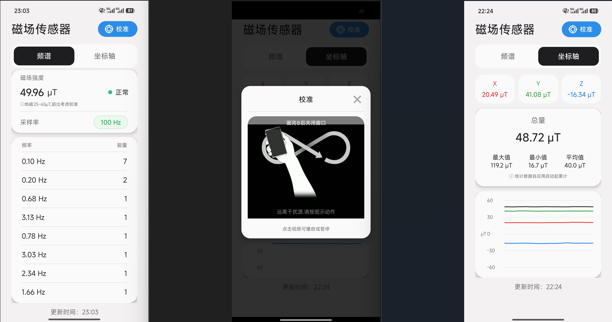
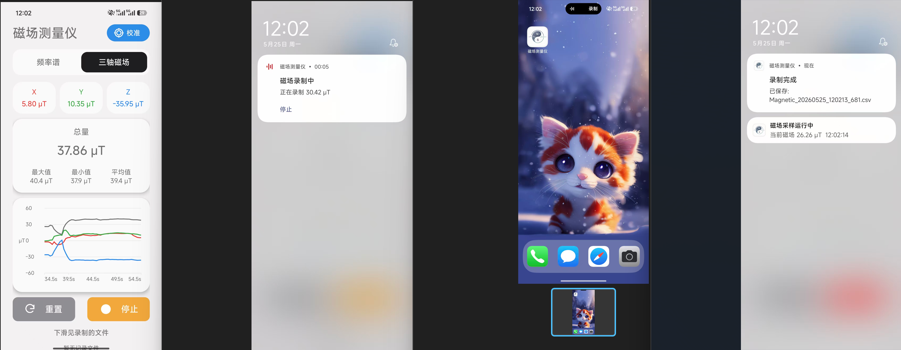
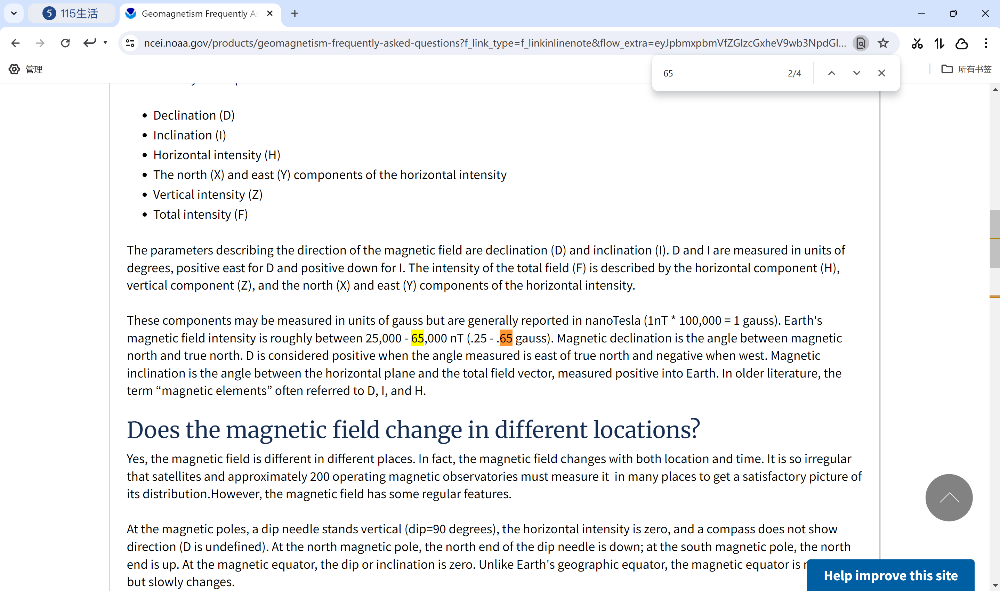
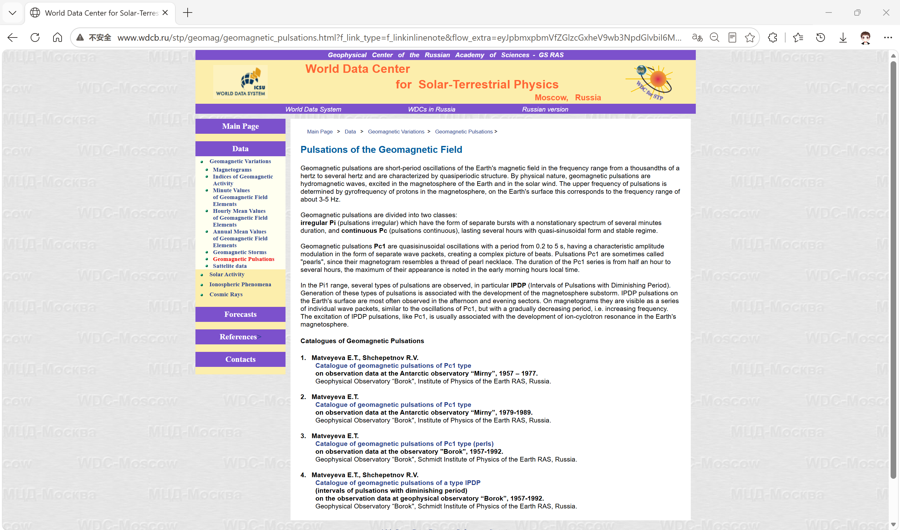

# Magnetic Field

一个最低支持 Android 7.0 的磁场强度小工具，界面按参考图做成浅色卡片风格。《电离层人工调制在水平分层电离层中所激发的ELF波辐射》_汪枫文章讲他们测得磁场是PT，频率0.5-2khz，手机是 μT哦

## 功能

- 最低系统：Android 7.0，API 24
- 读取手机磁力计数据
- 显示磁场强度，单位 μT
- 通过快速傅里叶变换显示能量最高的 8 个频率点，左侧为频率，右侧为能量
- 根据常见地磁范围显示 Stable （地球的磁场强度大致在25-65μT[1]） 或 Unstable

## 运行截图

## 参考
[1] 美国国家海洋和大气管理局：https://www.ncei.noaa.gov/products/geomagnetism-frequently-asked-questions?f_link_type=f_linkinlinenote&flow_extra=eyJpbmxpbmVfZGlzcGxheV9wb3NpdGlvbiI6MCwiZG9jX3Bvc2l0aW9uIjowLCJkb2NfaWQiOiJiMTg5ZDI5MmJiNzVmNDRhLTM1OTc0NGY0MzNiNDMxNDgifQ%3D%3D&enable_bottom_share_style=1&hybrid_event_param=HybridEventParams(enterMethod%3Dmessage_markdown_url%2C%20localPage%3Dchat%2C%20chatType%3Ddefault%2C%20duration%3D0%2C%20isRichMediaPictureLink%3Dfalse%2C%20mobMap%3D%7Bmessage_id%3D44583879408483330%2C%20previous_page%3Dlanding%2C%20is_immersive_background%3D0%2C%20chat_type%3Ddefault%2C%20reply_id%3D44583879408479746%2C%20enter_method%3Dlanding%2C%20conversation_id%3D14125227250447%2C%20enter_chat_method%3Dlanding%2C%20bot_id%3D7234781073513644036%2C%20current_page%3Dchat%7D%2C%20extra%3Dnull)&use_xbridge3=true&loader_name=forest&need_sec_link=1&sec_link_scene=im&theme=light

[2]http://www.wdcb.ru/stp/geomag/geomagnetic_pulsations.html?f_link_type=f_linkinlinenote&flow_extra=eyJpbmxpbmVfZGlzcGxheV9wb3NpdGlvbiI6MCwiZG9jX3Bvc2l0aW9uIjowLCJkb2NfaWQiOiI5Nzc5OWZiYTA0YWE4ODM4LTA4MWJmYjhkYWQwMjZjMTAifQ%3D%3D&enable_bottom_share_style=1&hybrid_event_param=HybridEventParams(enterMethod%3Dmessage_markdown_url%2C%20localPage%3Dchat%2C%20chatType%3Ddefault%2C%20duration%3D0%2C%20isRichMediaPictureLink%3Dfalse%2C%20mobMap%3D%7Bmessage_id%3D45914006756227074%2C%20previous_page%3Dlanding%2C%20is_immersive_background%3D0%2C%20chat_type%3Ddefault%2C%20reply_id%3D45914006756225282%2C%20enter_method%3Dlanding%2C%20conversation_id%3D14125227250447%2C%20enter_chat_method%3Dlanding%2C%20bot_id%3D7234781073513644036%2C%20current_page%3Dchat%7D%2C%20extra%3Dnull)&use_xbridge3=true&loader_name=forest&need_sec_link=1&sec_link_scene=im&theme=light

